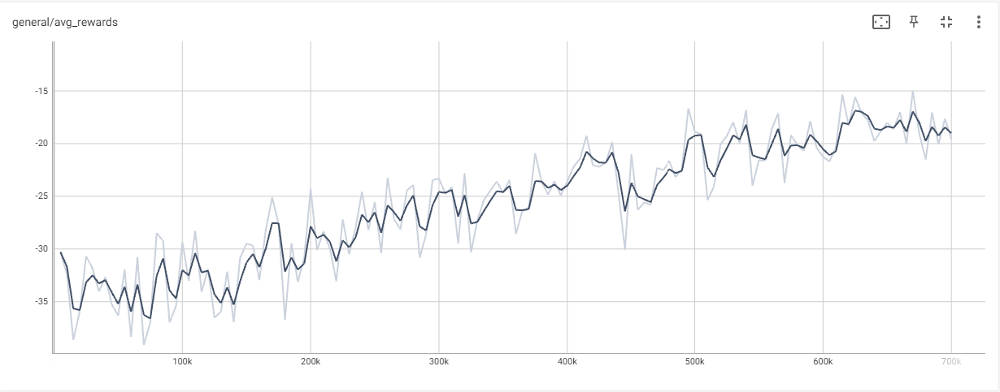
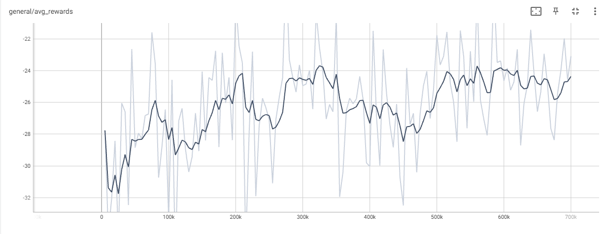
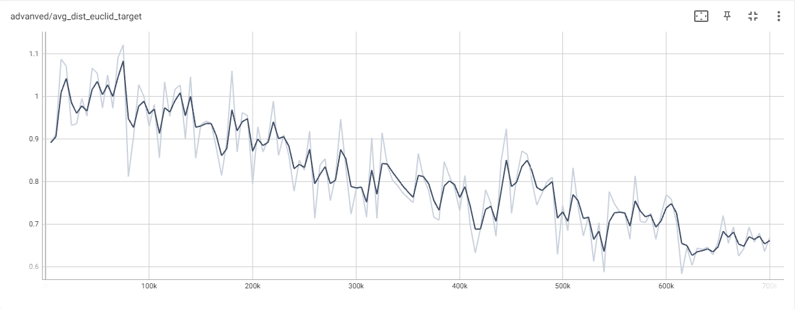
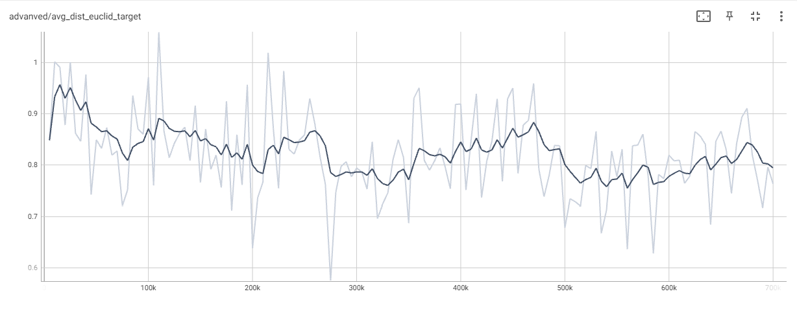
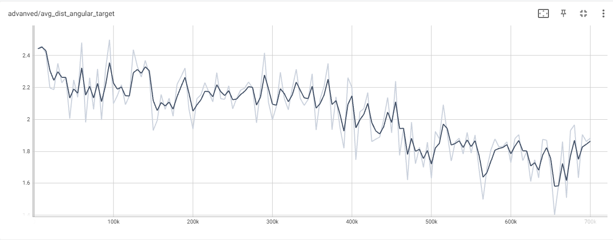
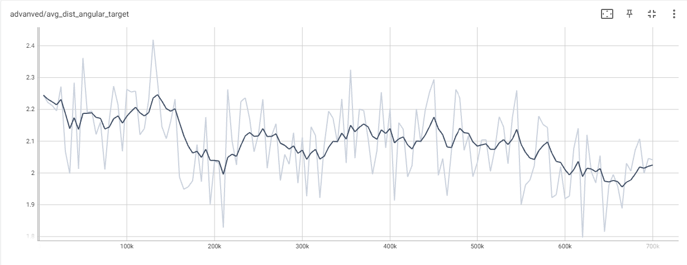

## Set Target Positions
A robot was trained for the task to reach a target cube spawned randomly by setting joint position targets. This training was executed with 20 parallel environments for 700.000 timesteps on a NVIDIA GeForce RTX 4070 Ti.

The average rewards for Pybullet (left) and Isaac (right):

    
    

The average euclidean distance for Pybullet (left) and Isaac (right):
{width=49%}
{width=49%}

The average angular distance for Pybullet (left) and Isaac (right):
{width=49%}
{width=49%}